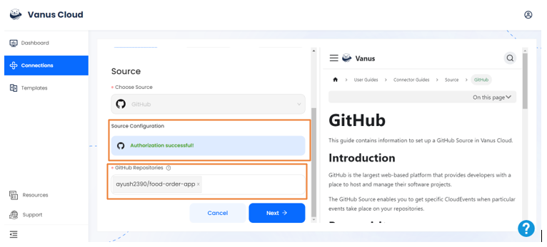
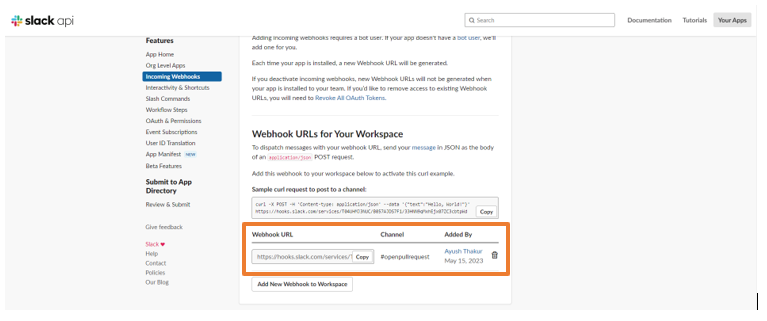
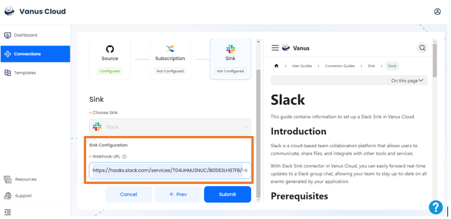

# GitHub opened pull request event triggers a Slack message

GitHub is the largest web-based platform that provides developers with a place to host and manage their software projects.

You can receive notifications when specific events occur in a repository by adding a GitHub Source on Vanus Cloud.

This guide will help you get a Slack notification whenever a pull request is opened in your repository.

<iframe
  width="800"
  height="450"
  src="https://www.youtube.com/watch?v=bESsX8lKCEY"
  title="YouTube video player"
  frameBorder="0"
  allowFullScreen={true}
  allow="accelerometer; autoplay; clipboard-write; encrypted-media; gyroscope; picture-in-picture; web-share"
></iframe>

## Get Started

### Step 1: Configure the Source - Authorize GitHub and select a GitHub repo

- Log in to [Vanus Cloud](https://cloud.vanus.ai/) and choose the **GitHub issue event triggers a Slack message** template.

- Find the **Sign in with GitHub** button and authorize GitHub. Then, select the repo you want to configure.

### Step 2: Configure Sink - Get the Slack Webhook URL

- Open Slack API and create a Webhook URL

Tip: For detailed steps on how to obtain the Slack Webhook URL, refer to the blog [Get Your Slack Webhook URL - A Quick Integration Guide](https://www.vanus.ai/blog/get-your-slack-webhook-url/).

### Step 3: Sink Configuration

- Go back to Vanus Cloud website and scroll down to Sink Configuration

- Copy and Paste the Slack Webhook URL in the Webhook URL section and click Submit

- Your connection has been succesfully created

Note: You can customize the display format and content of the notifications by configuring the **Subscription**.

- After submission, the status will show as **running**. Now everytime a user will open a pull request on your repository, you will instantly recieve a notification message

### Result Display

