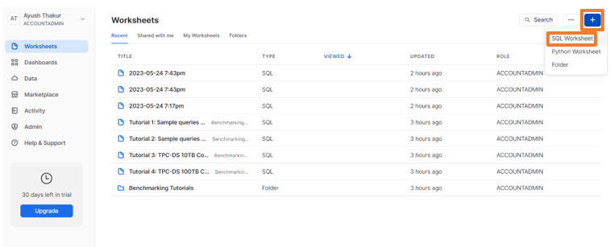
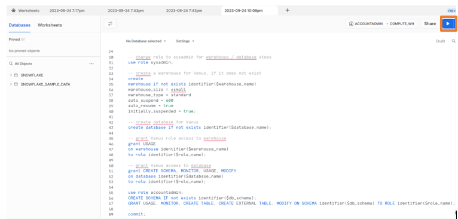
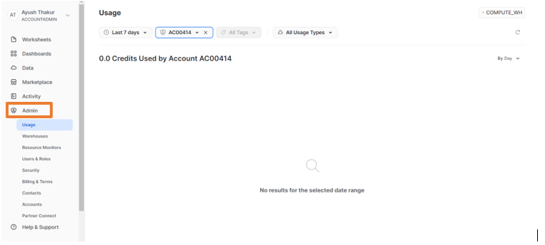

# Github Star Event Triggers a new row on Snowflake

GitHub is the largest web-based platform that provides developers with a place to host and manage their software projects.

You can receive notifications when specific events occur in a repository by adding a GitHub Source on Vanus Cloud.

This guide will help you get a new row on Snowflake everytime a user Star your Github repository.

<iframe width="800" height="450" src="https://www.youtube.com/embed/288VPfNx-Zs" title="YouTube video player" frameBorder="0" allowFullScreen={true} allow="accelerometer; autoplay; clipboard-write; encrypted-media; gyroscope; picture-in-picture; web-share"></iframe>

## Get Started

### Step 1: Configure the Source - Authorize GitHub and select a GitHub repo

- Log in to [Vanus Cloud](https://cloud.vanus.ai/) and choose the **Github Star Event Triggers a new row on Snowflake** template.

- Find the **Sign in with GitHub** button and authorize GitHub. Then, select the repo you want to configure.

### Step 2: Configure Sink - Get the Account URL

- Go to [Snowflake](https://www.snowflake.com/) and login with your account

- Click on + button on top-right corner and select the SQL worksheet

- Go back to connection setup, scroll down and copy the SQL code

- Paste it in the new SQL worksheet and save it

- Now go back to Snowflake dashboard and click on Admin

- Select the Account and copy the Account URL from top-right corner

### Step 3: Setting up the connection

- Paste the copied URL in the Account URL

- Fill up the other details like Role, Warehouse, Schema, etc as per your requirements

- Click Submit. Your connection is now succesfully created

- After submission, the status will show as **running**. Now everytime users Star your repository, you will instantly get a new row on Snowflake
