# S3 Delete Object Event triggers a Slack message

S3 is one of the most popular service provided by Amazon Web Services

S3 service allows the user to store objects through a web service interface

This guide will help you get a Slack notification whenever a new object gets uploaded on your S3 service

<iframe width="800" height="450" src="https://www.youtube.com/embed/qdijumpj8mA" title="YouTube video player" frameBorder="0" allowFullScreen={true} allow="accelerometer; autoplay; clipboard-write; encrypted-media; gyroscope; picture-in-picture; web-share"></iframe>

## Get Started

### Step 1: Configure the Source

- Log in to [Vanus Cloud](https://cloud.vanus.ai/) and choose the **S3 Delete Object Event triggers a Slack message** template.

### Step 2: Get Access key

- Go to [Aws Management Console](https://aws.amazon.com/) and login using your root account

- Search for IAM services and click on it

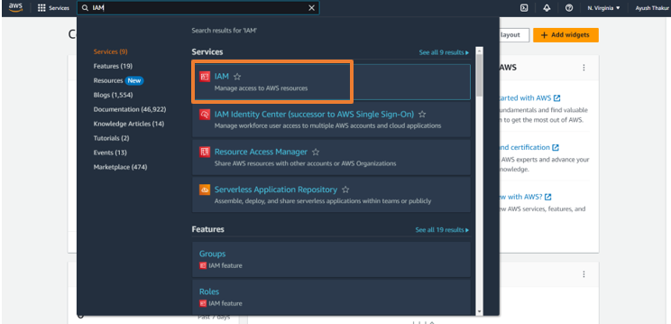

- Go to Users on left sidebar and click on Add User

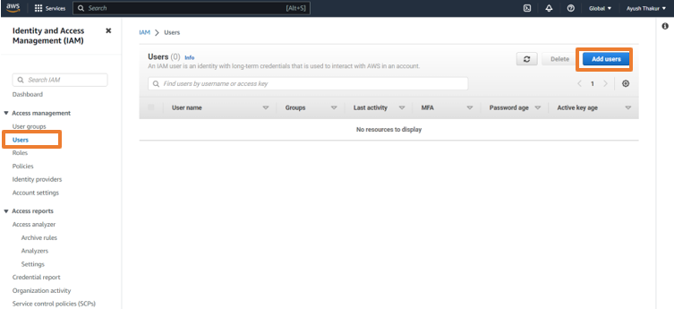

- Give a name to the user and click on Next

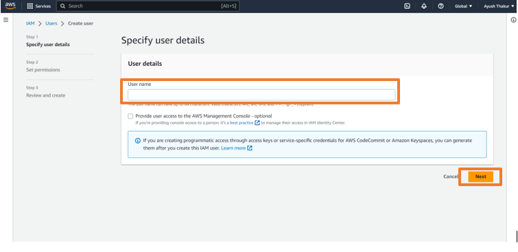

- Select Attach policies directly and click on Create Policy

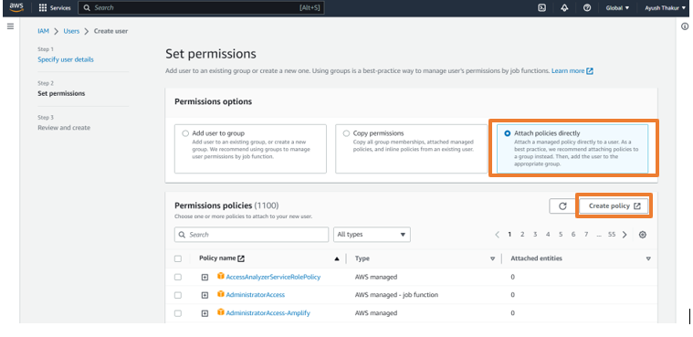

- Click on S3 and search for PutBucketNotification and select it

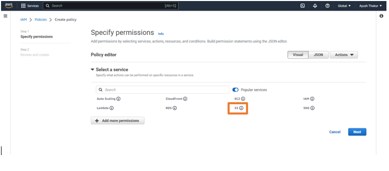

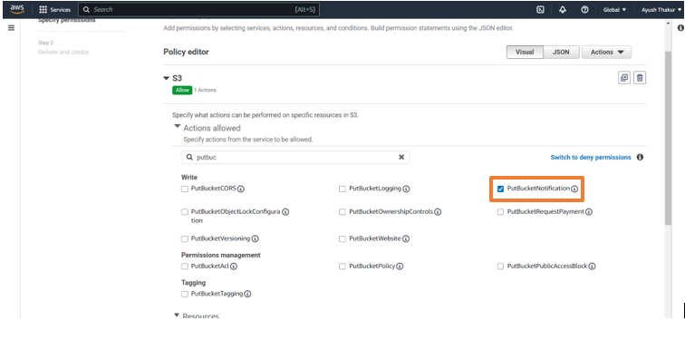

- Click on Add more permissions and search for SQS and click on it

- Now search these policies are add them:

1. ListQueues
2. GetQueueUrl
3. ReceiveMessage
4. GetQueueAttributes
5. CreateQueue
6. SetQueueAttributes
7. DeleteMessage

and press Next

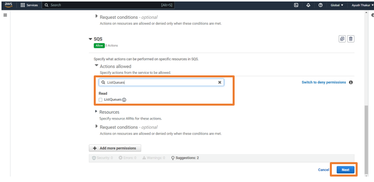

- Add a name to your policy and click on Create Policy

- Go back to the previous tab and refresh it

- Search for the custom policy we have created and select it and click Next

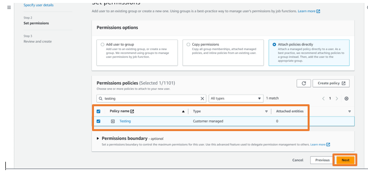

- Review it and click Create User

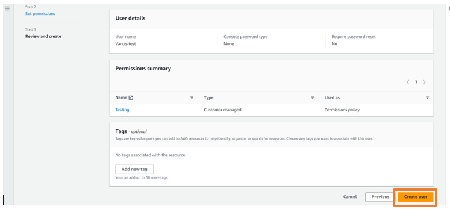

- Click on the created user and go to Security and Credentials tab

- Scroll down and click Create access key

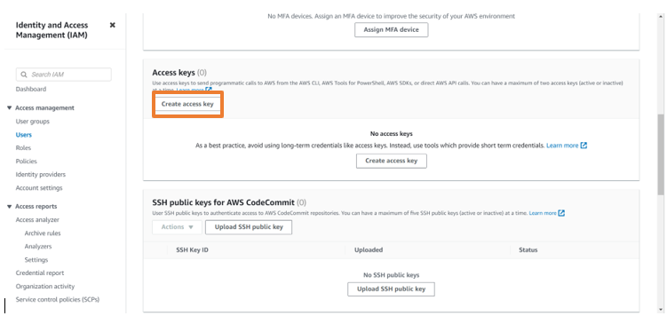

- Select Command line interface CLI, press Next and click Create access key

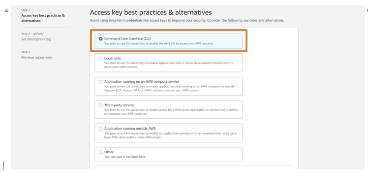

- Copy the access key and secret access key and paste them in Connection setup

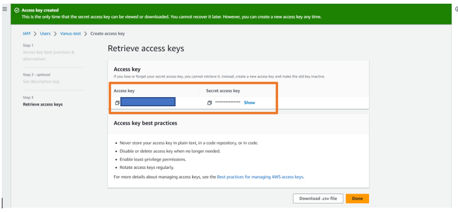

### Step 3: Create ARN number

- Go to AWS console and search for S3 service and click on it

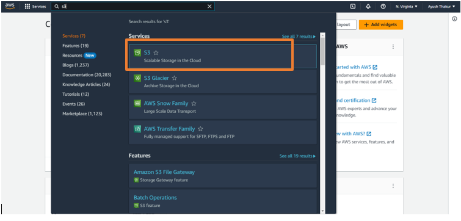

- Click on Create New bucket

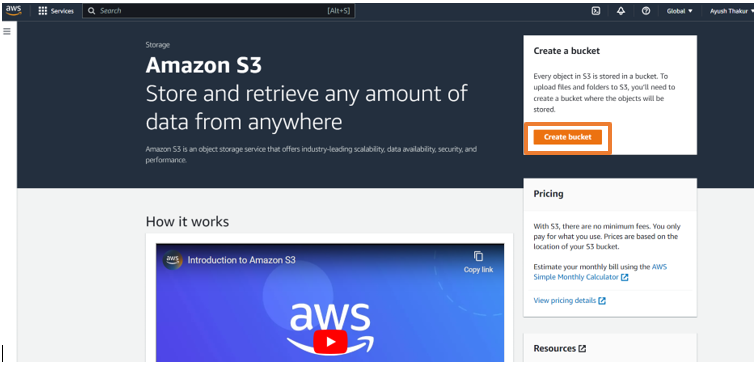

- Give a name to the bucket and click Create Bucket

- Open the created bucket and go to properties tab

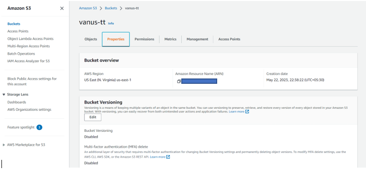

- Copy the ARN Number and paste it in connection setup and click Next

### Step 4: Configure Sink - Get the Slack Webhook URL

- Open Slack API in your browser, create a Webhook URL and copy it

Tip: For detailed steps on how to obtain the Slack Webhook URL, refer to the blog [Get Your Slack Webhook URL - A Quick Integration Guide](https://www.vanus.ai/blog/get-your-slack-webhook-url/).

- Paste the copied URL in the Webhool URL in the Sink Configuration and click Submit

- Your connection has been succesfully created
